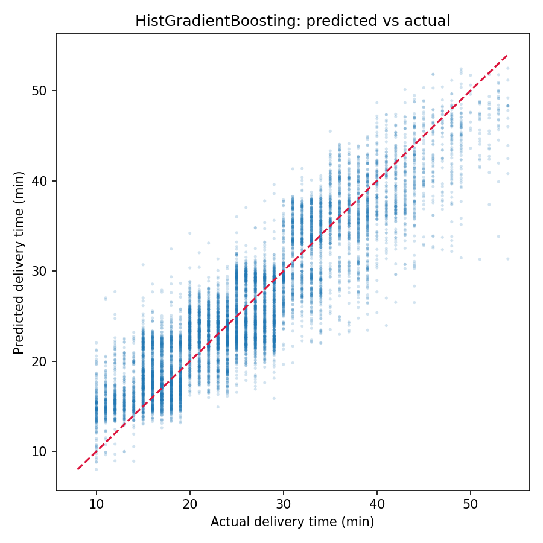
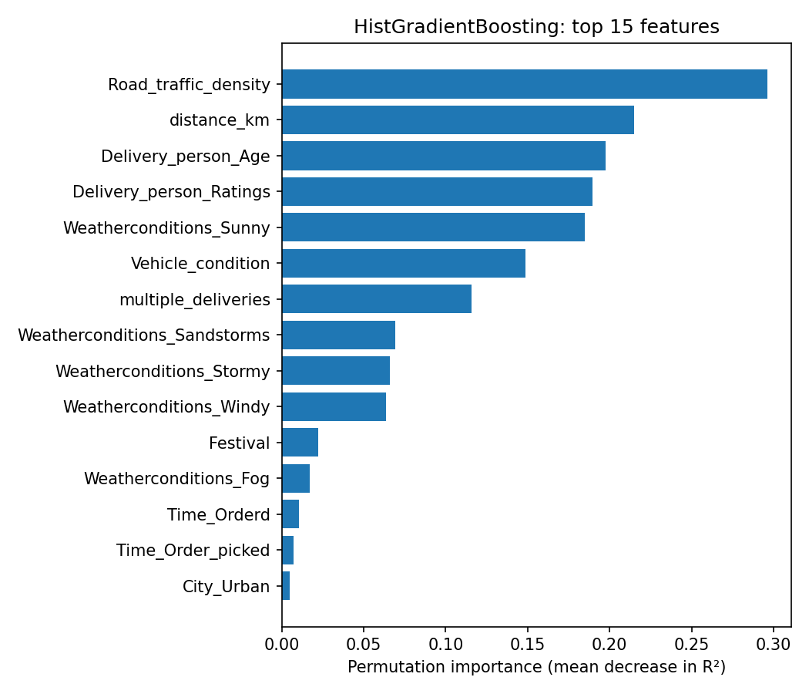

# Food Delivery Time Prediction

Predicting how long a food delivery will take, in minutes, from the conditions
known at the moment the order is placed — distance, traffic, weather, the
delivery rider, and the vehicle.

Trained on 45,593 real orders. The best model predicts within **±3.2 minutes on
average** (R² = 0.814).



---

## Results

Both models are evaluated on the same held-out 20% test split (9,119 orders).

| Model                    |   MAE |  RMSE |    R² |
| :----------------------- | ----: | ----: | ----: |
| RandomForest             | 3.257 | 4.105 | 0.808 |
| **HistGradientBoosting** | **3.226** | **4.040** | **0.814** |

MAE is the headline number: on a typical order the prediction is off by about
3.2 minutes. RMSE is higher than MAE because a minority of orders are badly
mispredicted, which the squared term punishes.

The scatter plot above shows the main weakness: the model regresses toward the
mean at both extremes. Very fast deliveries (~10 min) are over-predicted and
very slow ones (~50 min) are under-predicted. That is expected — the extremes
depend on factors the dataset does not record, like restaurant prep time.

### What actually drives the prediction



Measured by permutation importance (how much test R² drops when a single column
is shuffled), so it reflects real predictive contribution rather than how often
a feature happened to be split on.

Traffic density dominates, followed by distance. The two delivery-person
columns — age and rating — together matter as much as distance, which is a more
interesting result than it first looks: rider experience is roughly as
predictive as how far they have to travel.

---

## Dataset

45,593 orders with restaurant and delivery coordinates, order and pickup
timestamps, weather, traffic density, vehicle type and condition, and the
observed delivery time.

The raw file (`data/train.csv`) is committed so the project runs immediately
after cloning. It is genuinely messy, and the cleaning steps in `src/data.py`
each exist for a specific reason:

| Problem in the raw data | Handling |
| :--- | :--- |
| The literal string `"NaN"` used for missing values | Converted to real `NaN` **before** encoding, so it never becomes a category |
| `Time_taken(min)` stored as `"(min) 24"` | Prefix stripped, cast to numeric |
| `Weatherconditions` stored as `"conditions Sunny"` | Prefix stripped |
| Trailing whitespace on categorical values | Stripped, preventing duplicate one-hot columns |
| Ages and ratings stored as text | Coerced to numeric |
| `Order_Date` is day-first (`19-03-2022`) | Parsed as `%d-%m-%Y` |
| ~3,600 rows with placeholder coordinates near (0, 0) | Distance marked missing rather than kept as a 19,000 km outlier |
| Some coordinates carry a flipped sign | Magnitude used |

Missing values are **not** imputed. Both models handle `NaN` natively, so rows
with an unrecorded rating stay in the training set instead of being dropped or
filled with an invented value.

---

## Features

Distance is not in the dataset, so it is derived from the four coordinate
columns using the haversine formula. The rest:

- `distance_km` — great-circle restaurant-to-customer distance
- `order_to_pickup_min` — minutes between order placed and picked up, computed
  modulo 24h so an order at 23:55 picked up at 00:10 reads as 15 minutes
- `order_hour`, `is_peak_hour` — time-of-day effects
- `day_of_week`, `is_weekend` — weekly demand cycles
- `Road_traffic_density` — ordinal (Low → Medium → High → Jam), since the
  categories have a natural ranking
- `Festival` — binary
- One-hot: vehicle type, weather, order type, city type

Raw coordinates are dropped after `distance_km` is computed, so the model
learns from distance rather than memorising specific neighbourhoods.

Every feature is knowable before the delivery completes, so there is no target
leakage.

---

## Running it

```bash
git clone https://github.com/rajwhezee/food_delivery_time_prediction.git
cd food_delivery_time_prediction

python -m venv .venv && source .venv/bin/activate   # Windows: .venv\Scripts\activate
pip install -r requirements.txt

python -m src.train
```

Takes a couple of minutes. It prints the results table and top features,
writes the three figures to `reports/figures/`, and saves the winning model to
`models/model.joblib`.

To point it at a different CSV:

```bash
python -m src.train --data path/to/other.csv
```

---

## Project layout

```
data/train.csv          Raw dataset
src/
  config.py             Paths, random seed, data-validity thresholds
  data.py               Loading and cleaning
  features.py           Haversine distance, time features, encoding
  train.py              Trains both models, compares, saves the best
  evaluate.py           Metrics and figures
reports/figures/        Generated plots (committed, used in this README)
models/                 Saved model (generated, gitignored)
```

---

## Notes on the earlier version

This project was originally a single script. Rewriting it surfaced three bugs
that had been silently degrading the model:

1. **`Day_of_week` was 100% `NaN`.** Day-first dates were parsed with
   `format='%Y-%m-%d'` under `errors='coerce'`, so all 45,593 rows became `NaT`
   without raising anything.
2. **`Order_hour` was constant zero.** It was built by passing minutes-since-
   midnight into `pd.to_datetime()`, which reads bare integers as *nanoseconds
   since the epoch* — collapsing every row onto 1970-01-01 00:00.
3. **`order_to_pickup_time` went as low as −1,435 minutes**, from orders that
   crossed midnight.

Distances were also uncapped, reaching 19,692 km for a last-mile delivery, and
`"NaN"` had become its own one-hot weather category. Fixing these moved R² from
0.797 to 0.814 and MAE from 3.353 to 3.226.

The lesson worth keeping: `errors='coerce'` will hide a wrong format string
indefinitely. A dead feature costs accuracy without ever throwing.
